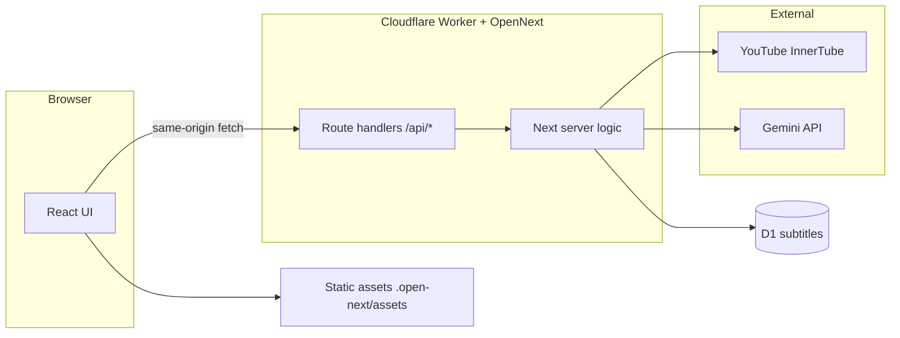
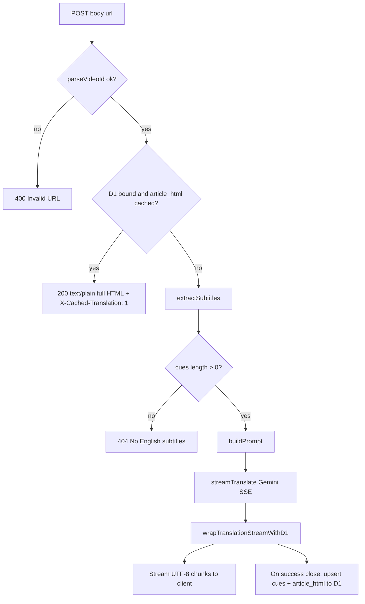
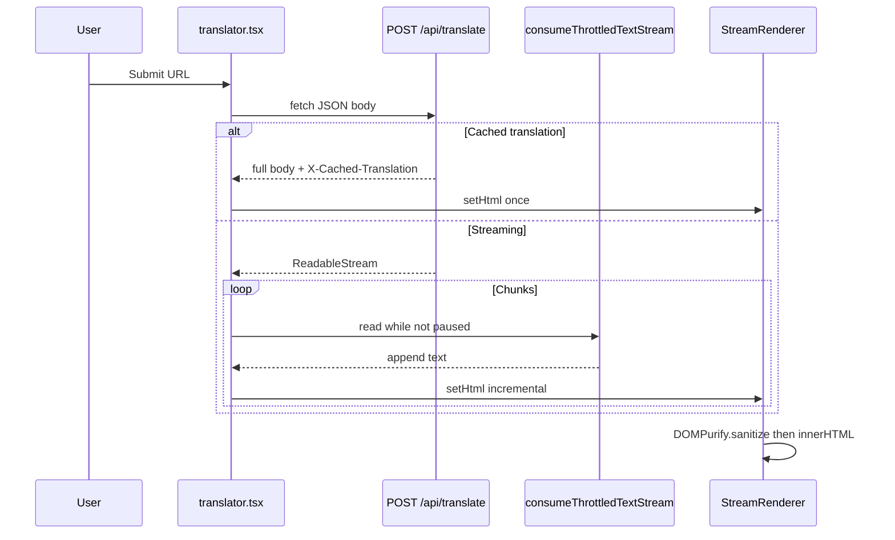

# YouTube Subtitle Translator

Next.js app that fetches **English YouTube captions** with [`youtubei.js`](https://github.com/LuanRT/YouTube.js) (InnerTube `/cf-worker` client), builds a prompt, and **streams** a Chinese **HTML article** from the **Google Gemini** API. The default model is **`gemini-3.1-flash-lite-preview`** (see `src/lib/gemini.ts`). The UI uses the **App Router** under `src/app/`.

## Stack

- **Next.js** 16 (`next build --webpack`), **React** 19, **TypeScript**
- **Tailwind CSS** 4, **Base UI** / shadcn-style components (`src/components/ui/`)
- **Cloudflare Workers** via **OpenNext** (`@opennextjs/cloudflare`) — see `open-next.config.ts` and `wrangler.toml`
- **D1** for optional subtitle + translated article storage
- **DOMPurify** for sanitizing streamed HTML before `innerHTML` (`src/components/stream-renderer.tsx`)

## Architecture

### Layers

| Layer | Responsibility | Main paths |
| ----- | ---------------- | ---------- |
| **UI (client)** | URL input, `fetch` to APIs, pause/resume stream consumption, local history/draft, export Markdown | `src/components/translator.tsx`, `stream-renderer.tsx`, `translate-form.tsx`, `history-panel.tsx` |
| **API (server)** | Validate input, optional D1 cache read, caption fetch, prompt build, Gemini stream, D1 upsert on completion | `src/app/api/translate/route.ts`, `src/app/api/subtitles/**` |
| **Libraries** | YouTube IDs, captions, prompt, Gemini SSE, D1 helpers, stream wrapper, client stream util | `src/lib/*` |
| **Data** | SQLite in D1: per-`video_id` row with JSON cues + `article_html` | `migrations/`, `wrangler.toml` binding `DB` |

**Runtime:** Production is an **OpenNext** bundle on a **Cloudflare Worker** (`main = .open-next/worker.js`). Static assets are served from the Worker asset binding; `/api/*` is handled by the Worker first (`run_worker_first`). **`npm run dev`** runs plain Next.js: no `DB` binding, so D1-only routes return **503**.

### Deployment topology



### `POST /api/translate` (server-side flow)



### Client translate + render (sequence)



**Maintainers:** When you change caching, streaming, D1 schema, or deploy bindings, update this section and the diagrams so they stay accurate.

## Requirements

- **Node.js 20+** (recommended)
- A **Google Gemini API key** ([Google AI Studio](https://aistudio.google.com/apikey))

## Environment

Copy the example file and add your key:

```bash
cp .env.example .env.local
```

| Variable | Required | Purpose |
| -------- | -------- | ------- |
| `GEMINI_API_KEY` | Yes | Server-side translation (`src/lib/gemini.ts`, `src/app/api/translate/route.ts`) |
| `HTTPS_PROXY` / `HTTP_PROXY` | No | **Node dev only** — global fetch proxy via Undici; see `src/instrumentation.ts` |

On **Cloudflare Workers**, do not commit secrets. Set:

```bash
npx wrangler secret put GEMINI_API_KEY
```

## Local development

```bash
npm install
npm run dev
```

Open [http://localhost:3000](http://localhost:3000).

## Scripts

| Script | Description |
| ------ | ----------- |
| `npm run dev` | Next.js dev server (default port 3000) |
| `npm run build` | Production build: `next build --webpack` |
| `npm run build:cloudflare` | OpenNext output for Workers (`.open-next/`); use in CI that deploys to Cloudflare |
| `npm run start` | Node production server after `npm run build` |
| `npm run lint` | ESLint on `src/` |
| `npm run lint:fix` | ESLint with `--fix` |
| `npm run format` | Prettier write (`src/**/*.{ts,tsx,css}`) |
| `npm run format:check` | Prettier check |
| `npm run preview` | `opennextjs-cloudflare build` + local Cloudflare preview |
| `npm run deploy` | OpenNext build + `opennextjs-cloudflare deploy` |
| `npm run upload` | OpenNext build + `opennextjs-cloudflare upload` |

## Deploy (Cloudflare Workers)

Production targets **Cloudflare Workers** with [**OpenNext for Cloudflare**](https://opennext.js.org/cloudflare) and [`wrangler.toml`](wrangler.toml).

1. Set `GEMINI_API_KEY` as a Wrangler secret (see above).
2. Apply D1 migrations (local and/or remote) if you use subtitle storage — see [D1 (subtitle storage)](#d1-subtitle-storage).
3. Run `npm run deploy` (or `upload` / `preview` as needed).

**Cloudflare Workers Builds / CI:** set the **build command** to `npm run build:cloudflare` (or `npx opennextjs-cloudflare build`). Do **not** rely on `npm run build` alone for a Worker deploy — that only runs `next build` and does not produce `.open-next/`, so Wrangler/OpenNext deploy can fail with a missing compiled OpenNext config. Keep the **deploy step** as your usual `wrangler deploy` / `opennextjs-cloudflare deploy` flow.

**Placement:** `wrangler.toml` sets `[placement] region = "gcp:us-west1"` to reduce latency toward US-west backends; adjust if your providers or audience differ.

You can still run **`npm run build`** + **`npm run start`** on any Node host.

## Features (UI)

- Paste a YouTube URL; supported shapes are parsed in `src/lib/youtube-id.ts` (**watch**, **youtu.be**, **shorts**, **embed** — 11-character video IDs).
- **Streamed** Chinese article HTML with **pause / resume / stop** during generation (`src/lib/consume-throttled-stream.ts`).
- **Local draft** and **history** in the browser (`src/lib/storage.ts`); history panel beside the form.
- **Export Markdown** from the current HTML (`src/lib/export.ts`: `html-to-markdown`, `download-blob`).
- Article view: **DOMPurify** sanitization, auto-scroll while streaming, **scroll to top** control when content is long.

## HTTP API

### `POST /api/translate`

Body: `{ "url": "<youtube-url>" }`

1. Resolves `videoId` from the URL; returns **400** if invalid.
2. If **D1** is available and the row has non-empty `article_html`, responds immediately with that HTML, **`Content-Type: text/plain; charset=utf-8`**, and header **`X-Cached-Translation: 1`**.
3. Otherwise fetches English captions via `extractSubtitles` (`src/lib/youtube.ts`). **404** if no English subtitles.
4. Streams Gemini output as **UTF-8 text** (incremental HTML fragments). After a successful full stream, **`wrapTranslationStreamWithD1`** (`src/lib/translation-stream-persist.ts`) upserts cues + `article_html` into D1 when the binding exists (errors logged; stream still completes).

### `GET /api/subtitles`

Query: `limit` (default 20, max 100), `offset` (default 0). JSON: `{ items, total, limit, offset }`. **503** if D1 is not bound (e.g. plain `next dev`).

### `GET /api/subtitles/[videoId]`

Full stored record: `video_id`, `title`, `lang`, `cues`, `updated_at`, `article_html`. **400** for invalid id shape, **404** if missing.

### `DELETE /api/subtitles/[videoId]`

Deletes one row. **404** if not found.

These JSON list/detail/delete routes are **unauthenticated**. If the app is public, add your own auth (e.g. bearer secret, Cloudflare Access).

## D1 (subtitle storage)

[`wrangler.toml`](wrangler.toml) binds D1 as **`DB`** (`database_name`: `youtube-subtitle`; `migrations_dir`: `migrations`). After clone, apply migrations:

```bash
# Local D1 (Wrangler / preview)
npx wrangler d1 migrations apply youtube-subtitle --local

# Remote D1 (dashboard-created database — use your account’s DB name/id in wrangler.toml)
npx wrangler d1 migrations apply youtube-subtitle --remote
```

Migrations:

- `0001_subtitles.sql` — table `subtitles` (`video_id`, `title`, `lang`, `cues_json`, `cue_count`, `fetched_at`, `updated_at`)
- `0002_article_html.sql` — adds `article_html` for cached translations

**Local Next without Workers:** `npm run dev` does **not** attach Worker bindings; D1-dependent APIs return **503** (“D1 database not available”). Use **`npm run preview`** or a deployed Worker to exercise D1 end-to-end.

## Project layout

| Path | Role |
| ---- | ---- |
| `src/app/page.tsx`, `layout.tsx` | Home shell |
| `src/app/api/translate/route.ts` | Translate + cache + stream |
| `src/app/api/subtitles/route.ts` | List stored videos |
| `src/app/api/subtitles/[videoId]/route.ts` | Get / delete one video |
| `src/lib/youtube.ts` | Captions via `youtubei.js` |
| `src/lib/youtube-id.ts` | URL → `videoId`, validation |
| `src/lib/subtitle.ts` | Subtitle/cue types |
| `src/lib/prompt.ts` | Prompt from cues |
| `src/lib/gemini.ts` | Gemini SSE streaming client |
| `src/lib/d1-subtitles.ts` | D1 access, list/get/upsert/delete, cache read |
| `src/lib/translation-stream-persist.ts` | Stream wrapper that persists HTML + cues to D1 |
| `src/lib/consume-throttled-stream.ts` | Client stream consumer (pause-aware) |
| `src/lib/export.ts` | Re-exports HTML → MD/plain + download helper |
| `src/lib/html-to-markdown.ts`, `html-to-plain-text.ts`, `download-blob.ts` | Export utilities |
| `src/lib/storage.ts` | Local history / draft |
| `src/components/translator.tsx` | Main flow: fetch, controls, history |
| `src/components/stream-renderer.tsx` | Sanitized HTML rendering |
| `src/components/translate-form.tsx`, `history-panel.tsx` | Form and history UI |
| `src/instrumentation.ts` | Optional Node proxy for dev |

## Gotchas

- **YouTube / InnerTube:** Caption fetching depends on `youtubei.js` and unofficial APIs; YouTube changes can break extraction without warning.
- **Model and endpoint:** `gemini.ts` pins a specific `generativelanguage.googleapis.com` model path; upgrades or renames may require editing that file.
- **Trust model:** Output is model-generated HTML; the client sanitizes with DOMPurify. Treat untrusted model output like any user-generated HTML if you change rendering.
- **Next.js APIs:** This repo targets **Next.js 16**; for App Router or route handler details, prefer the version shipped under `node_modules/next/dist/docs/` when behavior differs from older docs.

## Git commits

- Prefer **[Conventional Commits](https://www.conventionalcommits.org/)** (`feat:`, `fix:`, `docs:`, `chore:`, …).
- Do **not** append tool banners (e.g. `Made-with: Cursor`) to commit messages.

## Learn more

- [Next.js documentation](https://nextjs.org/docs)
- [OpenNext Cloudflare](https://opennext.js.org/cloudflare)
- [Wrangler](https://developers.cloudflare.com/workers/wrangler/)
